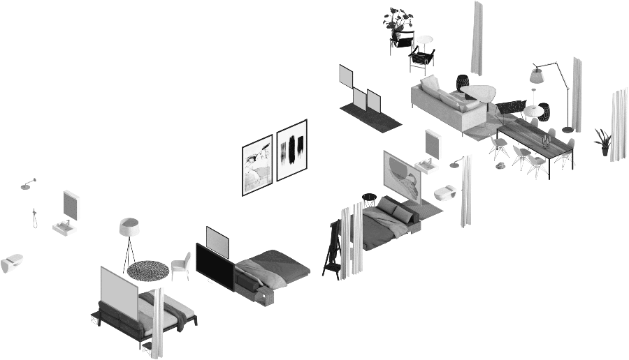
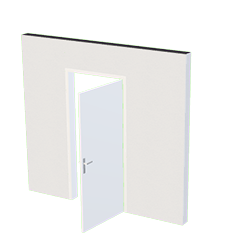
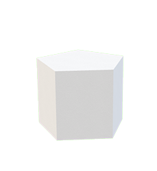
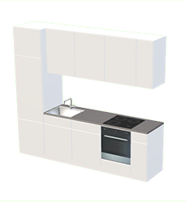
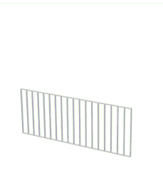
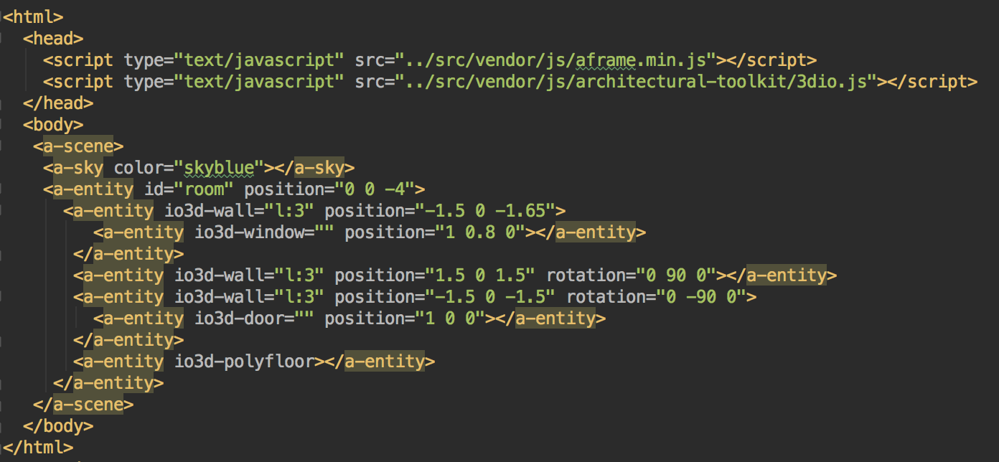
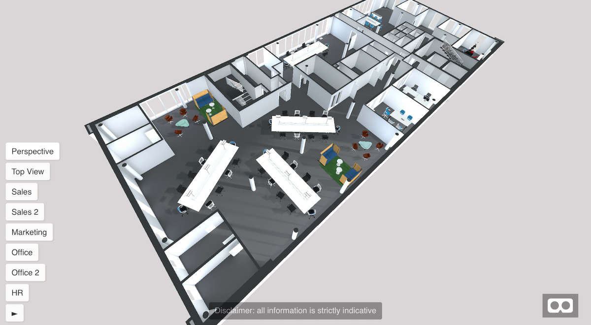
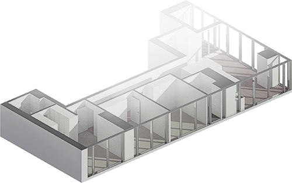

# A-Frame & its component system
 


Monika Kedrova | @salad_milk_soup | Archilogic/3d.io 

<!-- NOTES -->
- Onboard web developers into the 3D and VR world with easy-to-use tools
- Prototype WebVR experiences faster

------

# A-Frame

<!-- .slide: data-background="media/img/aframe-rendered-full.png" -->

A web framework for building virtual reality experiences

<!-- NOTES -->
- Launched last December
- Why:
  - Easy for web developers to create VR content, without graphics knowledge
  - Prototype and experiment WebVR and VR UX faster
  - Vehicle to kickstart WebVR ecosystem


------

## Hello World

<!-- .slide: data-background="media/img/aframe.jpg" data-transition="fade-in slide-out" -->

```html
<html>
  <script src="https://aframe.io/releases/0.7.0/aframe.min.js"></script>
  <a-scene>
    <a-box color="#4CC3D9" position="-1 0.5 -3" rotation="0 45 0"></a-box>
    <a-cylinder color="#FFC65D" position="1 0.75 -3" radius="0.5" height="1.5"></a-cylinder>
    <a-sphere color="#EF2D5E" position="0 1.25 -5" radius="1.25"></a-sphere>
    <a-plane color="#7BC8A4" position="0 0 -4" rotation="-90 0 0" width="4" height="4"></a-plane>
    <a-sky color="#ECECEC"></a-sky>
  </a-scene>
</html>
```
<!-- .element: class="stretch" -->

<!-- NOTES -->
- Just HTML
- Drop a script tag, no build steps
- Using Custom HTML Elements
- One line of HTML `<a-scene>` handles
  - canvas, camera, renderer, lights, controls, render loop, WebVR polyfill, VREffect
- Put stuff inside our scene...
- Basic 3D primitives with Custom Elements
- Readable: HTML arguably most accessible language in computing
- Encapsulated: copy-and-paste HTML anywhere else and still work, no state or variables
- Quickly look at a live example...

---

<div data-aframe-scene="scenes/hello-world.html"></div>

<!-- .element: class="stretch"-->

------

# Components

<!-- .slide: data-background="media/img/aframe-rendered-full.png" -->


------

<!-- .slide: data-background="media/img/community-components.png" data-background-size="contain" -->


<!-- NOTES -->
- Community has filled the ecosystem with tons of components
- Components can do whatever they want, have full access to three.js and Web APIs
- The component ecosystem the lifeblood of A-Frame
- Physics, leap motion, particle systems, audio visualizations, oceans
- Drop these components as script tags and use them straight from HTML
- Advanced developers empowering other developers
- Working on collecting these components...

------
 
## Components modify entities 
###(3D objects in the scene)

* modify the appearance, behavior, and functionality 
* components can modify entities using other components
* encapsulate three.js and JavaScript code 
    => which then can be used declaratively from HTML

<!-- NOTES -->
Components have full access to JavaScript, 
three.js, and Web APIs (e.g., WebRTC, Speech Recognition).
For building VR applications, we recommend placing all application code within components (and systems). 
Components can set other components on the entity, making them a higher-order or higher-level component in abstraction.

------

## 3d.io - architecture in A-Frame

<div style="float:left; width:45%"> 
<ul>
    <li>display complete 3D scenes</li>
    <li>display furniture </li>
    <li>use basic architectural elements</li>
</ul>
</div>

<div style="float:left;right:50%;top:30%;width:45%"> 

</div>

------

## Examples:

<div class="captioned-image-row"> 
  <div> 
     
    <i>wall / door</i> 
  </div> 
  <div> 
     
    <i>box / polybox</i> 
  </div> 
  <div> 
     
    <i>kitchen</i> 
  </div> 
  <div> 
     
    <i>Railing</i> 
  </div> 
</div> 

```html
<a-entity io3d-box="l: 1; h: 1; w: 1;" position="0 0 0"></a-entity>
<a-entity io3d-door="l: 0.9; h: 2; w: 0.05; hinge: right; side: back; v: 3; doorType: singleSwing;" position="0 0 0"></a-entity>
<a-entity io3d-kitchen="l: 4.2; h: 2.4; w: 0.6; elementLength: 0.6;" position="0 0 0"></a-entity>
<a-entity io3d-closet="l: 1.8; h: 2.4; w: 0.6;" position="0 0 0"></a-entity>
```

<!-- .element: class="stretch"-->

------
## Architectural toolkit



<!-- .element: class="stretch"-->

------

## Architectural toolkit + JS

```html
<script>
   // set API key (you can get your own publishable key at 3d.io)
   io3d.config({
     publishableApiKey: 'be62f9e4-1d86-489f-8bf6-dbefe83dc9f7'
   })
   // get the scene and convert it to a format that works with 3d.io API
   const roomEl = document.querySelector('#room')
   let structure = io3d.scene.getSceneStructureFromAframeElements(roomEl)
   // add furniture
   io3d.staging.getFurnishings(structure.children, {label: 'dining'})
   .then(result => {
     console.log(result)
     // convert the result to A-Frame components
     let elements = io3d.scene.getAframeElementsFromSceneStructure(result)
     elements.forEach(el => {
       roomEl.appendChild(el)
     })
   })
</script>
```

<!-- .element: class="stretch"-->

---

<div data-aframe-scene="scenes/architecture-demo.html"></div>

<!-- .element: class="stretch"-->

------

## Result



------

## Thank you!



Monika Kedrova | @salad_milk_soup | Archilogic/3d.io 


